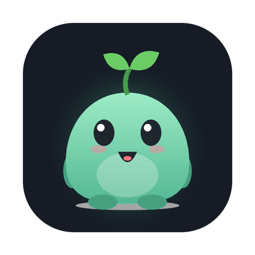

# Notchling 🌱

A tiny virtual pet that lives in your MacBook's notch. Feed it, bath it, pat it,
put it to bed, and ask it anything; it searches the web and answers with sources.



## Features
- **Tamagotchi care**: fullness, cleanliness, happiness, energy and health stats that
  decay over time (even while the app is closed, gently). Meals, snacks, baths, pats,
  bedtime, medicine, poop cleanup.
- **Grows up**: hatches from an egg, then baby, kid, teen and adult (the sprout on its
  head grows and flowers). Neglect it long enough and it runs away.
- **Ask tab**: chat with your pet. It uses Claude with web search and shows source links.
  Drop a PDF, image or text file on the notch and it "eats" it, then answers questions about it.
- **Petting**: stroke the pet with your cursor. Poke it too many times and it gets dizzy.
- Menu bar leaf icon for quick actions, original sound effects, open at login.

## Requirements
- macOS 14 Sonoma or later (works best on a Mac with a notch; others get a small pill at the top).
- A "brain" — all free options:
  - **Apple Intelligence** (automatic): macOS 26 Tahoe on Apple Silicon with Apple Intelligence on.
    Runs on your Mac, no account, no key.
  - **Google Gemini free key**: create one at https://aistudio.google.com/apikey (no credit card).
    Daily free limit.
  - Optional paid: Claude with an Anthropic API key (uses Anthropic's web search tool).
- Web search for the free brains uses DuckDuckGo and Wikipedia (no key). The DuckDuckGo results
  page isn't an official API, so if it ever changes, Wikipedia and DuckDuckGo Instant Answers
  still work.

## Build the installer
**Option A: on a Mac** (Xcode 26+ recommended):
```
./scripts/build-installer.sh
```
Output: `dist/Notchling-<version>.dmg`

**Option B: GitHub Actions** (no Xcode needed): push this folder to a GitHub repo, open the
**Actions** tab, run **Build installer**, and download the DMG from the run's artifacts.
Pushing a tag like `v1.0.0` also attaches the DMG to a Release.

## Sharing with friends
Send them the DMG. They double-click **Install Notchling.command** (or drag the app to
Applications). Because the app isn't notarised by Apple, macOS will warn the first time;
see `installer/READ ME FIRST.txt`. On a Mac with Apple Intelligence it just works; otherwise each friend
pastes their own free Gemini key in Settings. Never share your key.

## Credits
Architecture ideas (notch panel, hover handling, file drop, Keychain storage) are adapted
from [Coucou](https://github.com/louis-cfm/coucou) by louis-cfm, used under the MIT License
(see `LICENSE-coucou-MIT.txt`). Notchling's name, character, icon and sounds are original
and don't use Coucou's reserved assets.
